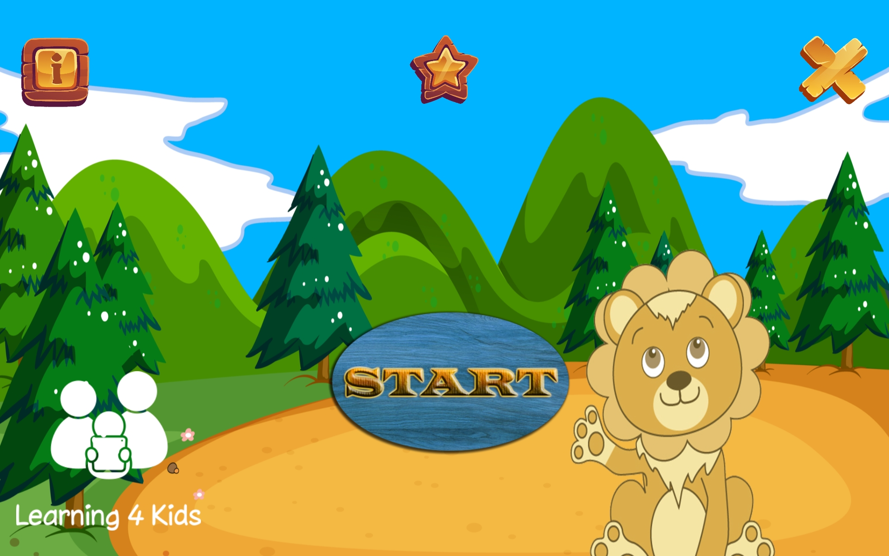
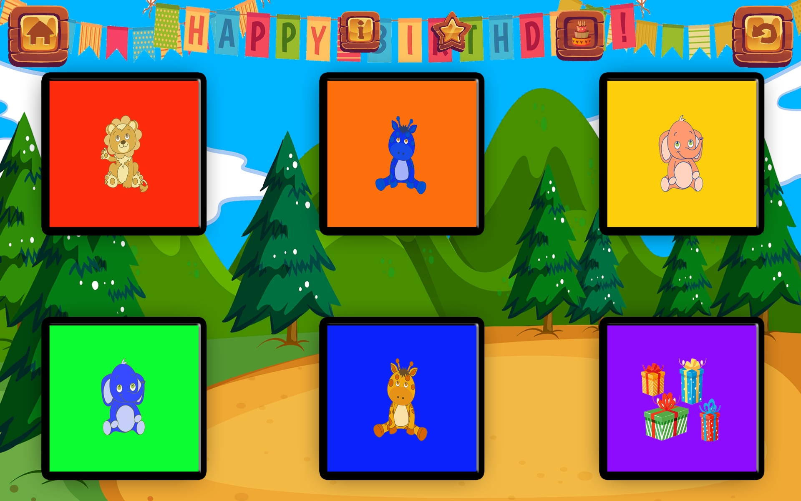
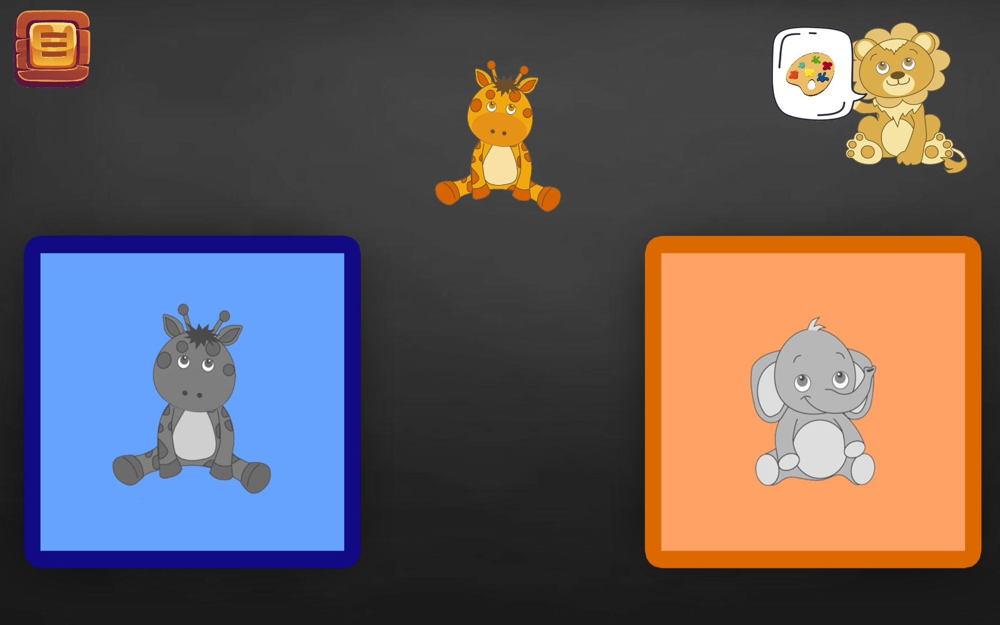

# task-switching

IDP task-switching game. \
Cognitive learning game for children run on Android tablets. \
This project was done in cooperation with the Ludwig-Maximilians-University in Munich. \
The game was developed with the Unity Game Engine and C#.

## Start Screen

## Level selection

## Level
Children are asked to play either the color or the shape game. \
In the color game they must match the top stimulus to the according color box and the shape game works analogously.
Matching the stimulus is done by drag & drop. \

